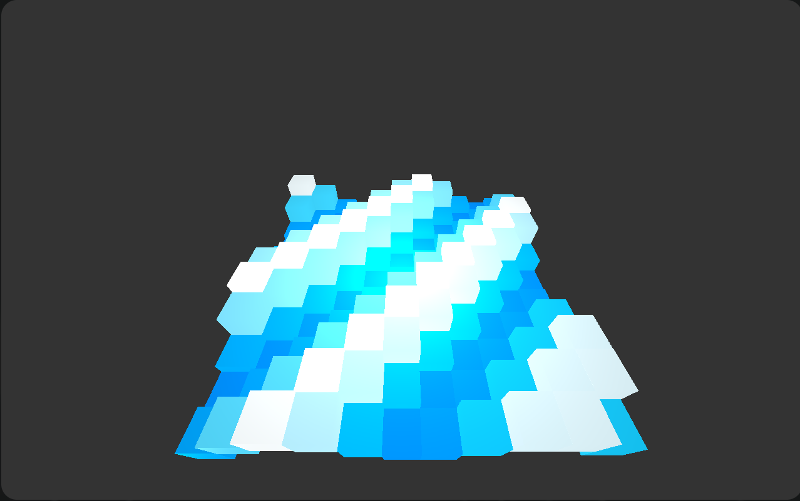

# Astrum Renderer 


# Introduction
Astrum is a basic 3D renderer scriptable with lua. It takes in an input script
That defines the behavior of the renderer.

One of the biggest goals with Astrum is to provide a very basic and intuitive 3D
rendering interface that anyone with any skill level can use. Because of this, Lua
scripts are used to provide a high level interface to Astrum's rendering capabilities.

# Install

## Dependendicies

- OpenGL
- GLFW
- Lua

(I plan on eventually handling these dependicies through cmake)

## Building

```
git clone https://github.com/Ethan-Heimer/Astrum-Renderer
cd Astrum-Renderer
mkdir build && cd build
cmake ..
make
```

alternativly:

```
git clone https://github.com/Ethan-Heimer/Astrum-Renderer
cd Astrum-Renderer
mkdir build
./build.sh
```
The binary can be found in `./build/bin/`

# Use

Starting the renderer is very simple:

```
./Astrum -s {script-name}.lua
```

Astrum will execute the script inputted.

# API
## Getting Started

When a script is ran with Astrum, it will first seek out 2 special user-defined
functons: `Start` and `Update`. 
### -- Start --
``` lua
function Start()

end
```

**`Start` Runs once when the script is loaded.**

`Start` is called only once when a script is **Loaded** or **Reloaded (Saved)**.
`Start` is intened to be used to initialize Astrum's initial state, i.e. define
global variable's values and create objects that will be persistant through Astrum's 
lifespan.


### -- Update --
``` lua 
function Update()

end
```

**`Update` Runs Continuously.**

`Update` is called throughout the life span of Astrum. `Update`'s
pourpose is to **Change** the state of the script, gloabl variables, and Astrum
objects. 

These are **Anchors**, and Astrum's way of interacting with the provided lua
script. All code that uses any of Asrtum's api should be placed in these functions.

## Rendering

There's a lot that renderer's can do, therefore, Astrum's API is split into multiple 
**SubAPI's**.

### Mesh SubAPI

| SubAPI Table | Description |


